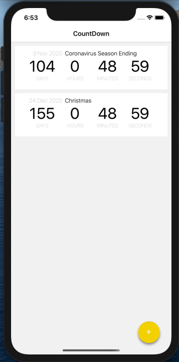

# CountDown App

As a start in this new technology, I took a React Native course in which I built a countdown application, with a list of multiple events with event adding functionality.
Using the base I created in the course, I tried to understand the concepts presented and move on with the development of the app. Therefore, I've added the update functionality and the delete functionality for an event, all the data coming from a local server.

## Demo

## Feature Done 

### v1.0

* Add Countdown Event
* Delete Countdown Event
* Update Countdown Event

